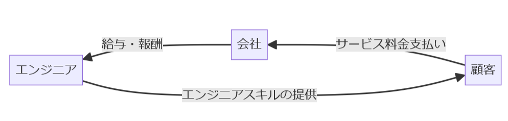
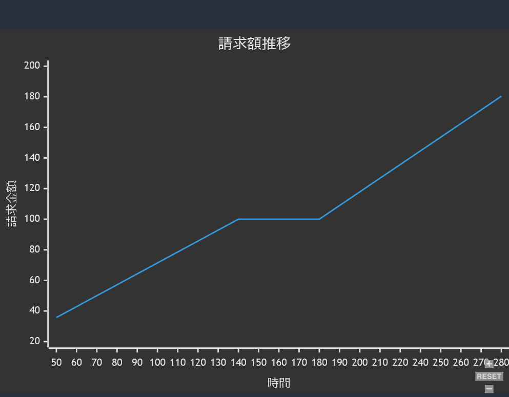

# SES

<!--
graph RL
A[顧客] -- >|サービス料金支払い| B[会社]
B -- > |給与・報酬| C[エンジニア]
C -- > |提供されたサービス| A
B -- >|サービスの提供| A
-->

## SESのお金の流れ



## SESのビジネスモデルと収益構造の説明

システムエンジニアリングサービス（SES）は、IT業界における一般的なビジネスモデルの1つで、エンジニアリングサービスをクライアントに提供します。このモデルでは、SES企業はエンジニアをクライアントのプロジェクトに派遣し、その労働内容に基づいて報酬を受け取ります。収益構造は主にエンジニアのスキルレベルに依存し、プロジェクトの予算、規模、期間によって変動します。

### 具体的な収益例と契約形態

月額単価モデルを例に取ります。SES企業がエンジニアを月額でクライアントに派遣する場合、エンジニアの月額単価が設定されています。たとえば、月額100万円の場合、クライアントからはこの金額が直接SES企業に支払われます。SES企業はこの中からエンジニアへの給料と社会保険料、事務手数料を差し引き、残りが企業の運営費や利益となります。

### SESの精算幅について

SES契約における「精算幅」とは、顧客に対して月に保証した労働時間の範囲を指します。具体的には、契約で定められた最低と最高の労働時間の間のことを言い、この範囲内で働いた場合には固定された報酬が支払われるシステムです。たとえば、「精算：140h-180h」という条件の場合、その月の労働時間が140時間から180時間の間であれば、事前に定められた月額の契約単価が支払われます。

#### 精算幅の下限を下回った場合

効率よく作業をして、月の労働時間が精算幅の下限（例: 140時間）を下回ってしまった場合（例: 130時間）、報酬は通常控除されます。この控除は「控除単価*下回った時間」で計算され、月額報酬から差し引かれます。控除単価は契約により異なるため、具体的な単価は契約書を参照する必要があります。

#### 精算幅の上限を超えた場合

一方で、月の労働時間が精算幅の上限（例: 180時間）を超えた場合（例: 190時間）、超過した時間に対して追加賃金が支払われます。この超過分の支払いは「超過単価*上回った時間」で計算され、通常の月額報酬に上乗せされる形で支払われます。こちらも超過単価は契約内容によって決まります。

単価100万円で「精算140h-180h」とされている場合の具体的な計算方法を以下に示します。ここでの単価は月額固定額を意味し、この範囲内での労働時間に対する支払いは固定されています。

#### 時間単価の計算
まず、時間単価を計算します。精算幅の最低時間（140時間）で割ります。

```精算
時間単価 
= 月額単価 / 精算幅の最低時間
= 1,000,000円 / 140時間
= 7143円/時間
```

#### 労働時間が精算幅の下限を下回った場合
例として、130時間しか働かなかった場合を考えます。下回った10時間分の金額が控除されます。

```精算
控除額
= 時間単価 * (精算幅の最低時間 - 実労働時間) 
= 7143円/時間 * (140時間 - 130時間)
= 71,430円

最終報酬額
= 月額単価 - 控除額
= 1,000,000円 - 71,430円 = 928,570円
```

#### 労働時間が精算幅の上限を超えた場合

例として、190時間働いた場合を考えます。超過した10時間分の金額が追加されます。超過単価が契約で通常単価より高い場合（例えば1.25倍とする）、計算は次のようになります。

```精算
超過単価
= 時間単価 * 1.25 = 7143円/時間 * 1.25
= 8929円/時間

追加賃金
= 超過単価 * (実労働時間 - 精算幅の上限時間)
= 8929円/時間 * (190時間 - 180時間)
= 89,290円

最終報酬額
= 月額単価 + 追加賃金 = 1,000,000円 + 89,290円
= 1,089,290円
```

このように、精算幅に基づいた時間単価を用いて、労働時間が下限または上限を超えた際の控除額や追加賃金を計算します。この計算方法は、SES契約の精算幅が設定されている場合に特に重要です。

#### SESの請求額推移

<!--
xychart-beta
title "請求額推移"
x-axis "時間" [50, 60, 70, 80, 90, 100, 110, 120, 130, 140, 150, 160, 170, 180, 190, 200, 210, 220, 240, 250, 260, 270, 280]
y-axis "請求金額" 20 --＞ 200
line [35.7130, 42.8560, 49.9990, 57.1420, 64.2850, 71.4280, 78.5710, 85.71400, 92.85700, 100, 100, 100, 100, 100, 108.9290, 117.8580, 126.7870, 135.7160, 144.6450, 153.5740, 162.5030, 171.4320, 180.3610, 189.2900]
-->

単価100万、精算幅が140時間から180時間の場合の請求額のグラフを作成してみました。



SESでみなし残業を**控えめ**に40時間付けたとします。月々40時間きっちり残業したとします。

```
1日の作業予定時間 * 1月の稼働日数 + みなし残業時間
= 8時間 * 20日 + 40時間（みなし残業）
= 200時間
```

そうすると従業員の月々の作業時間は200時間、精算幅は180で精算幅から20時間頭がでます。この20時間分は会社が利益として獲得できるためSES企業がブラック化しやすい一因になっています。

ただ、みなし残業が悪いというわけではなく**明らかに過剰なみなし残業**を付けている会社は警戒する必要があります。

#### SESと派遣の違い

SESと派遣の主な違いは、指揮命令権の所在にあります。SESでは、エンジニアは準委任契約のもとで特定の企業に所属し、その企業がエンジニアの業務指示を行いますが、クライアントは具体的な業務の命令や勤怠管理を行う権限はありません。一方、派遣では、エンジニアは派遣元企業に所属しつつ、実際の業務指示や勤怠管理はクライアント企業が行います​。

こちらはSESと派遣の主な違いを表にまとめたものです。

| | SES | 派遣  |
|-|-|-|
| **指揮命令権** | SES企業が持ち、クライアントにはない | クライアントが持

ち、派遣元企業にはない |
| **契約形態** | 準委任契約 | 派遣契約 |
| **業務の指示** | SES企業がエンジニアに指示を出す。<br>クライアントは直接指示を出せない。| クライアントが派遣社員に直接業務指示を出す。 |
| **勤務地** | 主にクライアント企業内| 主にクライアント企業内 |
| **労務管理**   | SES企業が行う  | 派遣元企業が行う |

#### 準委任契約について

SESにおける準委任契約は、SES企業とクライアント間で結ばれる契約形態の一つです。この契約により、エンジニアはクライアントの指定する業務を実施しますが、具体的な業務の実行方法についてはエンジニアに一定の裁量が認められています。また、顧客がエンジニアの労務管理を担当し、クライアントは勤怠管理や直接の業務指示を行うことはできません。

### 善管注意義務

準委任契約の受任者は、善管注意義務を負います。

準委任契約は、業務を完成する義務は負いません。しかし、業務を遂行する過程では善管注意義務を負うため、注意義務を欠いたために委託者に損害を与えた場合には、損害賠償などの義務を負います。

民法 第六百四十四条: <br>https://elaws.e-gov.go.jp/document?lawid=129AC0000000089#Mp-At_644-Pr_1

> （受任者の注意義務）
第六百四十四条　受任者は、委任の本旨に従い、善良な管理者の注意をもって、委任事務を処理する義務を負う。

## まとめ

覚えておく点

- SESは作業時間でお金を貰う
- SESには成果物の義務はない
- SESと派遣は違う
- 善管注意義務を忘れずに

はい、これらSESの問題点は**無能でも座っていれば儲かる**が出来上がります。そのため未経験でも無理に案件に入れようとする詐称事案が発生したり、成果物の義務を負わないので成果を出さない、作業しないという事案が発生します。

SESについては要員募集が多いためフリーランスや少人数のIT会社などがやってるイメージはあります。受託や自社サービスと違いリスクが低いためです。
