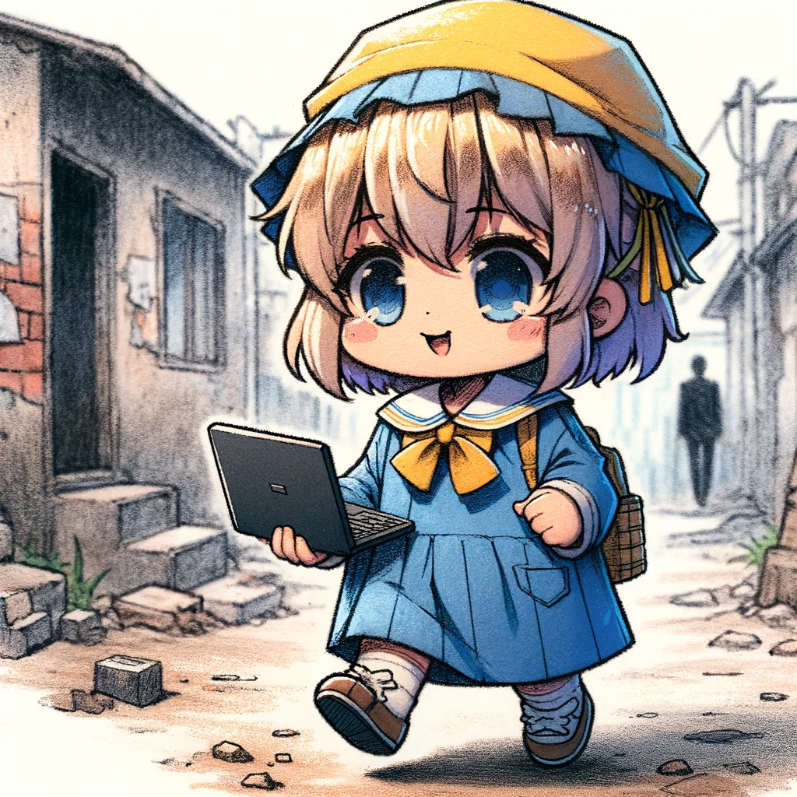

# 第一章: SNSの住人たち

ソーシャルメディアの世界に特化したIT業界の生物たちを探究します。彼らはオンラインのコミュニケーションと自己表現に特化し、デジタル社会における新しい振る舞いやトレンドを形成しています。

## 園児ニア

{width=50%}

### 生態

- 園児ニアは、その名の通り「エンジニアになりきれない子どものような存在」。
- SNS上のインフルエンサーや高年収情報に騙されて発生します。
- 彼らは技術的な専門知識が不十分で、本格的なエンジニアリングのスキルを持ち合わせていません。
- SNSでの活動が活発で、自分の意見や活動を積極的に発信しようとしますが、内容はしばしば未熟で表面的です。会社内などに居るとわがままが多く嫌われることが多いです。「僕は次のステージに行くんだ」と言って転職することが多いです。
- 園児ニアは成長しません。成長を促すことは諦めたほうがいいでしょう。

## 駆け出しエンジニア

{width=50%}

### 生態

- 駆け出しエンジニアは主にプログラミングを始めたばかりの駆け出したエンジニアのこと。
- 駆け出しエンジニアは勉強を一人で行うことが辛いので主にコミュニティに入る、形成、繋がり合おうとします。
- 勉強アピールを行っていることが多いですが、勉強時間に見合った成果を見せることが少ないです。
- コミュティ形成のせいで同様の個体が集まったり、また園児ニアと繋がったため園児ニア化することが多いです。
- 特殊個体としてはプログラミングへの適応力が高く、順応する個体が稀に存在します。

## アニマルエンジニア

{width=50%}

### 生態

- かつては人だったとされる人の形を辞めたエンジニア。アニマルエンジニアという名称は動物が多いためであるが、他のものになるものもいる。
- 人の形を保てなくなった忙しいエンジニアが転生したものとされている。
- 猫アイコンなど語尾に「にゃ～、にゃ～」付けてたりすることがある。
- 普段は温厚な態度を示すが、話題によっては凶暴性が出ることがあるので注意。

## SESガー

{width=50%}

### 生態

- かつては人だったとされる人の形を辞めたエンジニア。アニマルエンジニアという名称は動物が多いためであるが、他のものになるものもいる。
- 人の形を保てなくなった忙しいエンジニアが転生したものとされている。
- 猫アイコンなど語尾に「にゃ～、にゃ～」付けてたりすることがある。
- 普段は温厚な態度を示すが、話題によっては凶暴性が出ることがあるので注意。
