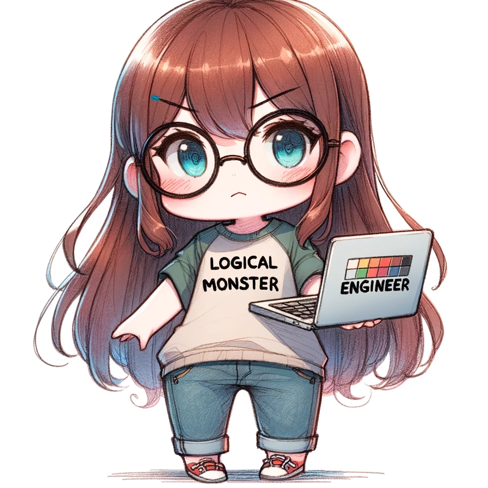
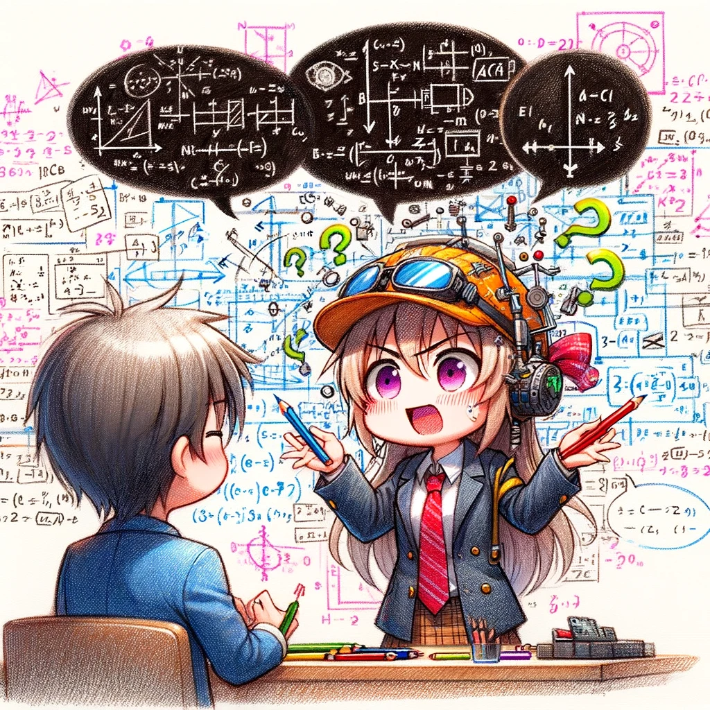

# 第二章: クリエイター

IT業界に多いのはクリエイターです。クリエイターはエンジニアからWebデザイナーなど様々なものを指しています。

## 社畜エンジニア

{width=50%}

### 生態

- 会社で飼育されているエンジニア。多くは中小企業に存在するが大手企業内などにも存在する。任されている仕事量が通常とは異なり、多種多様で色々なことをやらされる。
- どのような企業でも発生します。仕事が過酷で低給であれば発生しやすいです。環境適応する前に死んでしまう個体も多いので狙って発生させないほうがいいです。
- 仕事が忙しく、身なりに気を使えないことが多い。また仕事で運動できないため太りやすい。仕事が忙しいのでストレス解消も昼休憩のやけ食いだったりします。
- 彼らは会社に忠義心があるため社畜を選んでいる。と思われていることがありますが、現場が好きで離れたくないなど本当は**自社に対しての忠義心は低い**という研究結果もあります。仕事が忙しく転職活動がままならないなど様々な理由で社畜から脱せないことが多い。またすぐに転職先を決めてまた同じ社畜となってしまうことがある。

## Qエンジニア

{width=50%}

### 生態
- 質問ばかりしてくる。
- 「質問することは良いこと」で育った。質問し答えを教えてもらい、甘やかされて育ったため、質問ばかりしてきて自分で調べることを辞めた。
- 成長することはありません。成長しないで質問ばかりしてくるのでチームメンバーに迷惑が掛かるので早めに放しましょう。
- 質問することで他人から多くの時間を奪い、酷い個体になると**「わからないのでサンプルコードを書いて」**と言って作業を他人に任せます。

## ロジカルモンスター

{width=50%}

### 生態

ロジカルモンスターはロジックで成り立っているコードの世界で生きています。

- コードばかり扱っている場合になりやすい傾向があります。ロジックに傾倒しすぎるとエンジニアから進化して発生します。
- 服装などは論理的に必要がなければ特に無関心です。
- 必要がなければ人とコミュニケーションを取ろうと考えません。基本的にコミュニケーションも不要と考えています。
- 合理的でなければ不満を抱くことが多いです。具体的な数値にならない「協調性、コミュニケーション能力」など評価しない傾向が多いです。

## 古代エンジニア

{width=50%}

### 生態

- 古代エンジニアは古い時代からのエンジニアの生き残りである。全く新しい言語を触れることなく生きている希少な存在。
- 古くからシステムを作っている企業、古い言語のみを扱う現場にずっと居たエンジニアがなったもの。
- COBOLやFORTRANなどの古い言語のコードを書く。既存のシステムを保守、読み解くものが必要なので現場からは離れることもできないので新たな言語などの勉強の必要性がない。若者が居ないせいで40歳でも若手扱いを受けることがある。
- 新しい人が入ってこないので焦りもなく、退職などによる個体数減少により、システムが減っても需要と供給のバランスが取れてしまっている。ただ彼らが絶命する前にすべてのシステムがリプレイスされないと……

## チェアウォーマー

{width=50%}

### 生態

- 主にSESの時間精算が発生する現場にいるものです。
- 無能なエンジニアがSESの現場に送り込まれることで発生します。
- エンジニアを名乗っては居るが経歴詐称であったり、たしかに経歴はあっているが**経歴書に書かれた仕事はやったつもりで誰かが巻き取っていた**りする。
- 居るだけで迷惑なのだが契約上1～3ヶ月おいて置かなければいけないことがあり、仕事を任せると邪魔になったりするので**やらなくても良い作業を振っておく**ことで対応する必要がある。

## オタクエンジニア

{width=50%}

### 生態

- アニメ、漫画などが好きなオタクなエンジニアである。IT業界に多く見られる。
- 夏と冬に開かれる某聖戦に参加することが多い。そのため、その時期は仕事を休む。
- オフィスのデスクなどに好きな作品のグッズを置くことが多い。稀に昼休みにプラモデルの制作をしていたりする個体も居る。
- 知らずに好きな作品、アニメや漫画を軽視するような発言をすると、敵視されることがあるので注意。

## 専門用語エンジニア

{width=50%}

### 生態

- あまりにもプログラミングとの親和性が高い場合になることがある。
- 常に専門的な言葉を使って話す。しかし、一般的な会話や社交的なスキルには疎い。そのため通訳が居ないとやり取りが難しく会社などが放逐されるケースが多い。
- 能力は高いが、その能力を活かせる通訳が必要になります。
- 彼の専門用語を解釈し翻訳出来る者。プログラミングなどに精通し、複雑な専門用語を理解し、顧客やメンバーに理解できるように説明できる必要があり、コストは高いです。
- 専門用語ばかり話すが、実際は意味不明な事ばかり喋り、エンジニアとしての能力が低いものがいるがそれは専門用語エンジニアではなく園児ニアの可能性があるのでないので注意されたい。

## ドキュメント不要エンジニア

{width=50%}

### 生態

- スタートアップや小規模開発チーム、ドキュメント文化が希薄な企業に生息。
- 新しいメンバーがチームに加わった時や、長期間プロジェクトから離れた後に戻ってきた時、彼らの書いたコードを理解するのはほぼ不可能になる。これは、ドキュメントの不在が原因で、コードの意図や機能の詳細が不透明になるためである。
- 彼らの存在は、チームにとって長期的なリスクをもたらす。なぜなら、彼らがプロジェクトから離れると、彼らのコードを理解し、維持するのが非常に困難になるからだ。また、バグが発生した際に仕様が不明になることが多く、デバッグや修正作業が余計に複雑になる。
- このタイプのエンジニアは、コードの可読性や保守性に対する意識が低いため、プロジェクトの将来に重大な影響を及ぼす可能性がある。特に大規模なプロジェクトや長期にわたる開発では、彼らの行動がプロジェクトの成功を阻害する要因となることも少なくない。
- 口癖は「ドキュメントを書く時間がもったいない」「ソースが仕様」

## コンフリクター

{width=50%}

### 生態

- コードは書けるが、ブランチの管理ができず、マージの際に頻繁にコンフリクトを発生させる。
- 自分のコード変更を他のブランチとマージする際に常に問題を引き起こす。彼らはしばしば、自分の変更が他の人の変更と競合することを認識せず、結果として「マージ地獄」を引き起こす。
- この生きものは、Gitの基本的なコンセプトを完全に理解していないか、単に注意深くないために問題が生じる。そのため、コードレビューやマージ作業は常に時間がかかり、他のチームメンバーを困らせる。
- 興味深いのは、彼らは自分が問題を引き起こしていることにしばしば気づかない。そのため、他のチームメンバーが彼らに対して指摘をするまで、問題の解決に取り組もうとしないことが多い。
