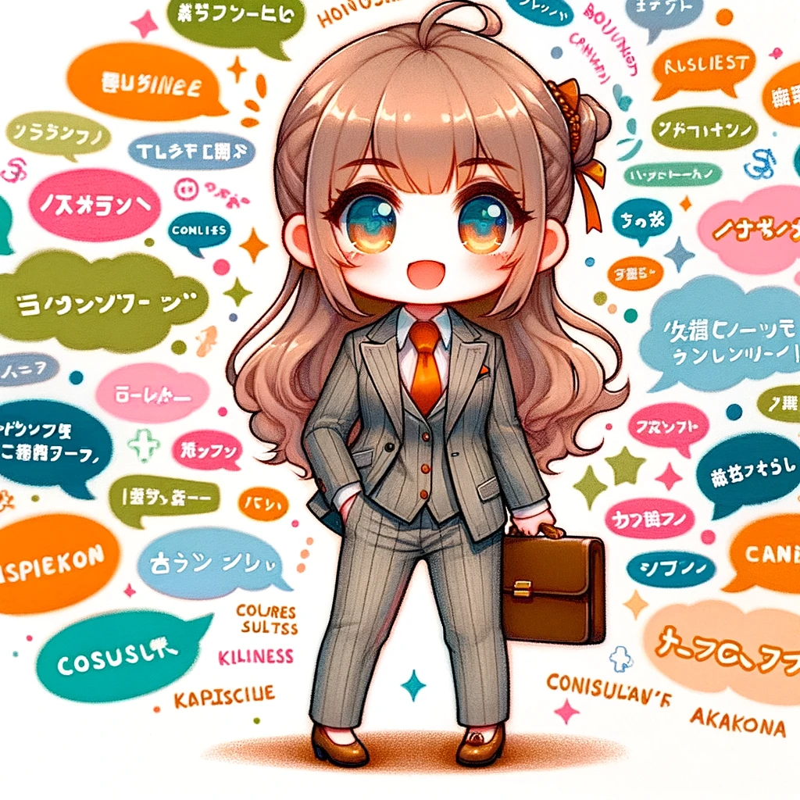

# 第三章: コンサル・マネジメント

コンサルやマネジメントなども不思議な人がいっぱいです。

## カタカナコンサル

{width=50%}

### 生態

- 実際にコンサルタントだったり自称コンサルタントだったりするがカタカナ語を連発する。
- シナジー効果やアウトプットの最大化を目指すも、未熟な新卒コンサルに頻発。彼らはインパクトを求めてカタカナ語を駆使する。
- ベンチマーキングやベストプラクティスといったコンサルティング業界のジャーゴンを連発。しかしこれらはクライアントにはネガティブなフィードバックを受けがち。ステークホルダーの間でのコミュニケーションは、アンビギュアスな状態で進行し、結果的に曖昧なコンセンサスを得ることが多い。
- 彼らのコミュニケーションがビジネスの現場でアクションに結びつくことは稀で、そのスタイルは時に **フォーマライズドなワードプレイ** と揶揄されることも。しかし、彼らのアプローチは、エコシステム内でのダイナミックなプレゼンスを持つことも事実。

## エンドレスミーティング

{width=50%}

### 生態

- どこにでも現れるが、同じ会社の人間以外からは確認し辛いナマモノ。
- 能力がある人間がなりやすい。**とりあえず** で打ち合わせに呼ばれてしまうことも多々ある。
- 顧客とのミーティングからチームメンバーとのミーティング、また会社のミーティングと様々なミーティングに呼ばれる。酷くなるとランチミーティングに呼ばれ、ランチもミーティングになる。顧客の営業時間内は顧客とのミーティング。複数顧客、複数プロジェクトなどに関わっているためずっとミーティング。定時後に自社のミーティングなどもある。

## デッドラインマネージャー

{width=50%}

### 生態

- リリースのデッドラインを守るためなら品質を犠牲にしても構わないとする行動パターン。リリース後のトラブルは後から対処するという楽天的な姿勢を持つ。
- ハイペースでプロジェクトが進むIT企業、特にリソースが限られている環境。
- リリースと同時にプロジェクトから離れるや、リリース日を変更できないなどの理由から締切のみ守ろうとする。
- デッドラインを何が何でも守るという一点においては卓越している。しかし、その結果、品質が低下し、結局はリリース後の無限バグ対応と顧客からの苦情処理に追われる。
- プロジェクトの成功をデッドラインの遵守にのみ求め、長期的な品質やチームの健康には目を向けない。結果として、チームの士気低下や顧客満足度の低下を引き起こす。
- 最悪の場合、損害賠償のリスクを覚悟しつつも、**退職するから大丈夫** という楽観的な考えを持つ。このため、組織全体の信頼と評判にも影響を与える可能性がある。
