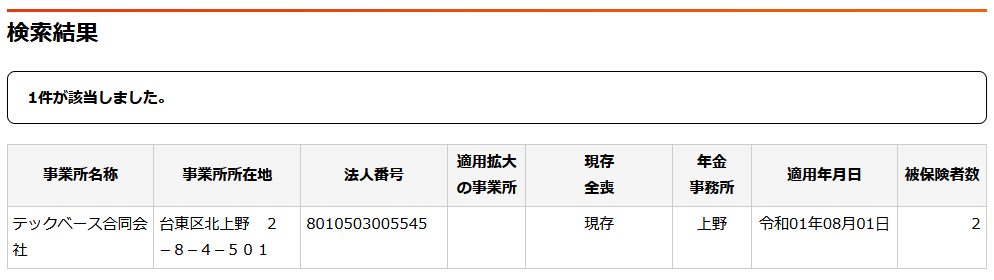
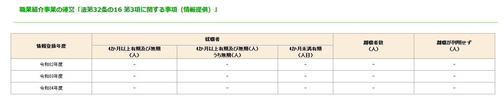

# 気になる会社の調査方法

ここまで色々な収益モデルをご紹介させていただきましたが、もし読者が転職する機会などがあれば会社も調べてもらいたいなと考えました。

では会社の調査方法を簡単ですがご紹介させていただきます。

## 会社を調べる

会社を調べるにも様々な手があります。これらを頭の片隅に置いておいて頂ければ転職時だけではなく取引先の調査時などにも使えます。

### gBizINFO


gBizInfo: https://info.gbiz.go.jp/index.html

経産省が公開している情報をまとめているgBizInfoがとても素晴らしいです。  
特許などの様々な情報をまとめられています。

<hr class="page-wrap" />

### 国税庁法人番号公表サイト


国税庁法人番号公表サイト: https://www.houjin-bangou.nta.go.jp/

会社の登記を調べましょう。以下の情報がわかります。

- 法人番号
- 商号又は名称
- 本店又は主たる事務所の所在地
- 最終更新年月日

### 登記事項証明書

法務局: https://houmukyoku.moj.go.jp/homu/shomeisho_000002.html

法務局で申請すると有料で法人登記情報が貰えます。郵送も可能です。

<hr class="page-wrap" />

### 年金機構


年金機構: https://www2.nenkin.go.jp/do/search_section/

厚生年金に加入している会社なら、被保険者数からおおよその社員数がわかります。

例として技術書典の運営会社のテックベース合同会社を載せさせていただきました。



### しょくばらぼ


しょくばらぼ: https://shokuba.mhlw.go.jp/

厚生労働省の「しょくばらぼ」では採用情報や勤務実態が確認できます。

<hr class="page-wrap" />

## 上場企業

### 決算書

EDINNET: https://disclosure2.edinet-fsa.go.jp/WEEK0010.aspx

上場企業なら決算書は公開義務があります。

### 株価

株式系サイトで企業のニュースや株価情報が確認できます。

## 非上場企業

非上場企業は決算書などの情報は基本的に見つからないことが多いです。調査を活用しましょう。

一応、非上場企業でも公告の義務はあるんですが出してない企業は多いです。

会社法 第四百四十条: <br>https://elaws.e-gov.go.jp/document?lawid=417AC0000000086#Mp-At_440
> （計算書類の公告）<br>
**第四百四十条**　株式会社は、法務省令で定めるところにより、定時株主総会の終結後遅滞なく、貸借対照表（大会社にあっては、貸借対照表及び損益計算書）を公告しなければならない。

<hr class="page-wrap" />

### 派遣


人材総合サービスサイト 許可・届出事業所の検索: <br>https://jinzai.hellowork.mhlw.go.jp/JinzaiWeb/GICB101010.do?action=transition&screenId=GICB101010&params=0

派遣業を行っている企業の情報も確認できます。  
重要なのはマージン率です。

## 転職関係

### 人材紹介サービス


人材紹介サービスサイト: <br>https://jinzai.hellowork.mhlw.go.jp/JinzaiWeb/GICB101010.do?action=initDisp&screenId=GICB101010

職業紹介事業の許可・届出事業所を検索できます。

検索結果を見ると職業紹介の実績が載せられていますが、これも情報提供の義務はないようなので情報提供していない場合は下記のようになります。

<hr class="page-wrap" />



情報提供していないからと言って悪い企業とは断言できませんが、良い企業とも決して言えません。

## 給与概算

企業情報調べていくと公開されていなくても~~X上で社長が言ってたりなどして~~売上くらいはわかったりすることはあります。とても単純でわかりやすい計算なのですが例えば年商1億と言っても社員が20人いた場合、以下のような計算になります。

```php:売上単価計算
売上 / 社員数 * 一人当たりの諸経費率 = 一人頭の概算給与
1億 / 20人 * 70％ = 350万
```

単純に一人頭の平均売上が500万、そこから社保や様々な経費を引かれるとして諸経費率を30%と設定。そのため70%を掛けます。そうすると平均概算給与は350万。

また一人頭の売上が500万のため、どう頑張っても平均給与は500万を超えることはありえません。在籍年数やスキルによって最低、最高額は変わると思いますのでご注意ください。

## まとめ

覚えておくこと

- 気になった企業があればまずは調べる
- 公的なデータは嘘を付けない
- 手に入る情報から会社情報を推察する
